### Literalura  
  
Repositório do curso oracle-one alura 2024 
   
- Consumir a API REST GUTENDEX([gutendex](https://gutendex.com)) e persistir os dados consumidos.
- Spring Boot Data Jpa(Hibernate).
- Banco de dados PostgreSQL. 
- IDE Eclipse 2024-12.
- Plataforma: Win10 Single Language.   
  
    
      
        
<video controls width="250">
  <source src="/output/Literalura-Gravar_2024_12_13_10_36_00_88.webm" type="video/webm" /> 
</video>  
  
    
      
      
# **SGBD POSTGRES DASHBOARD**  
  
  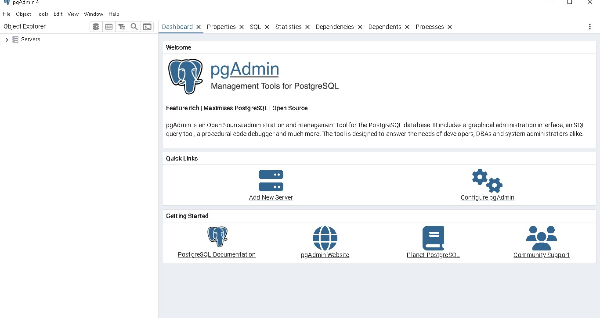  
  
  
 

- **POSTGRES Consultas** 
  
    
  
  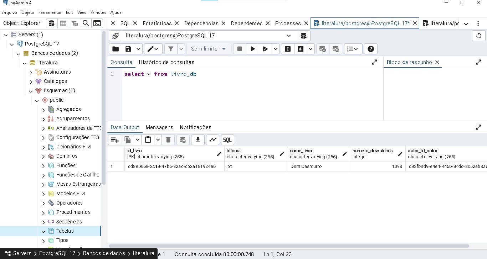  
    
      
    
  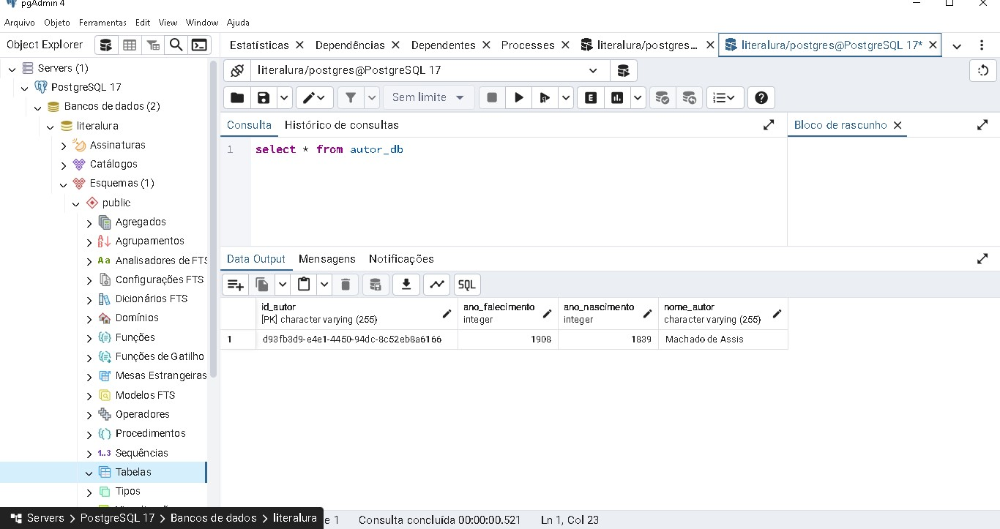  
    
     

  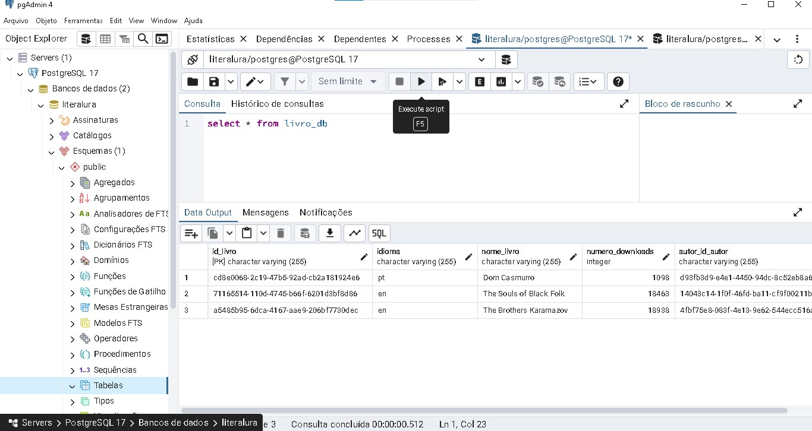  
    
      

  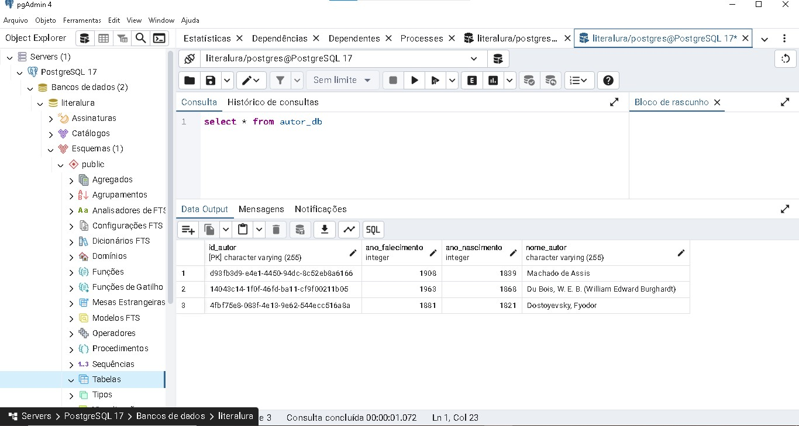  
      
   
   
      
***
 - **SAÍDA DO PROJETO** 
   
   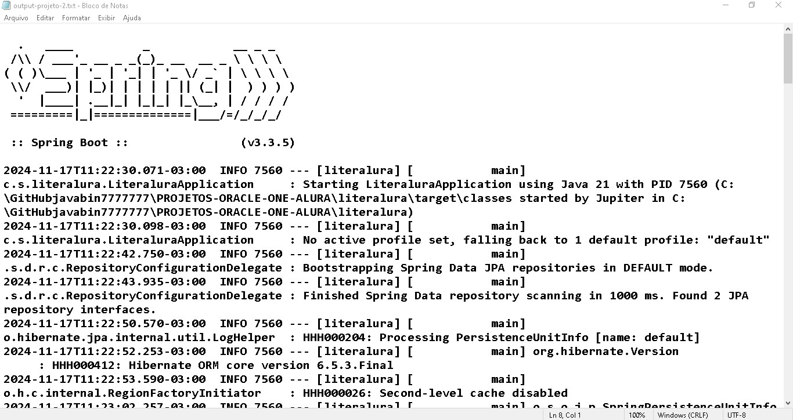
     
      
      
   

***   
         
   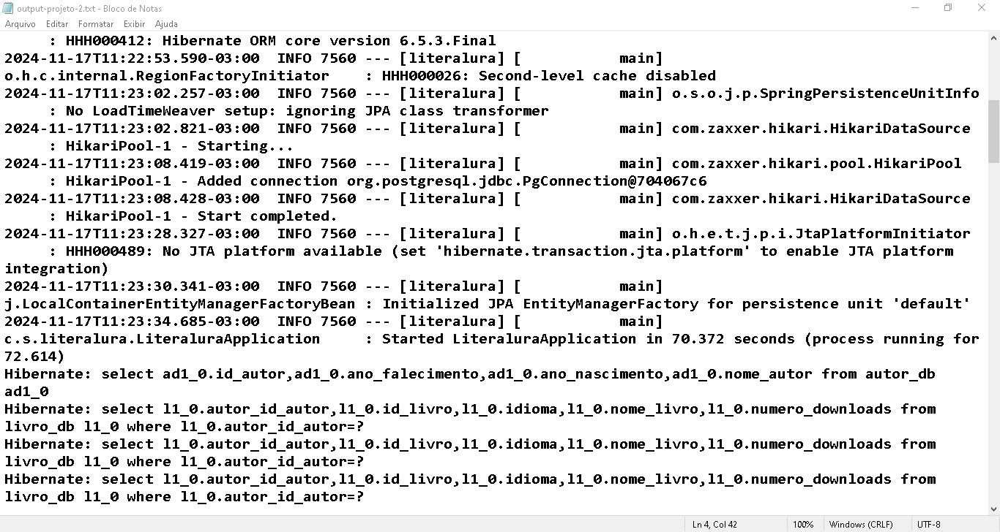 
  
   
   
      
        
***     
        
   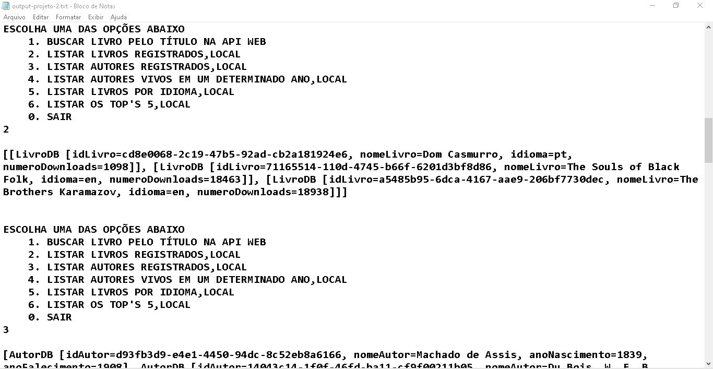 
     
***  
      
     
     
***  
  
  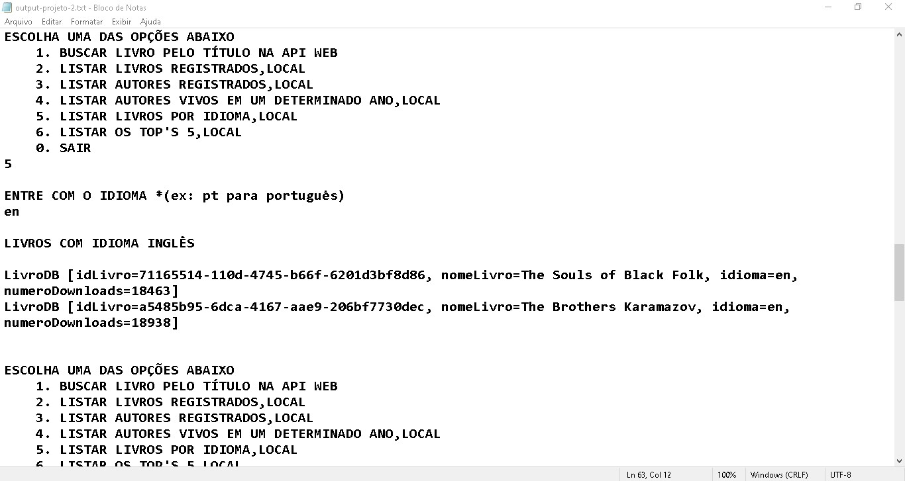  
    
***  
  
  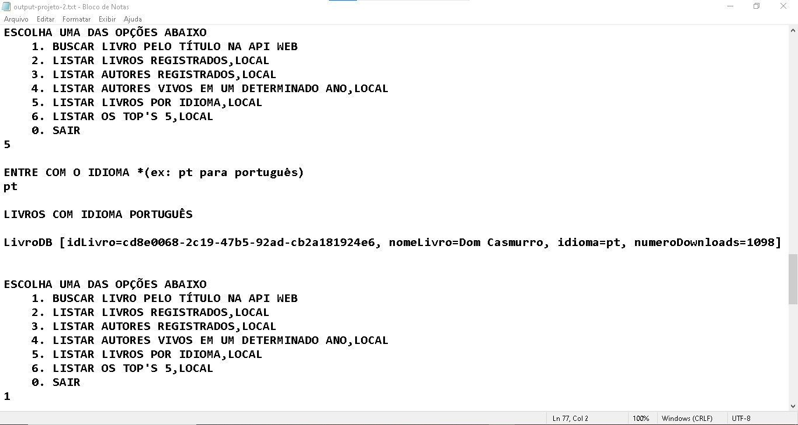  
    
***  
  
  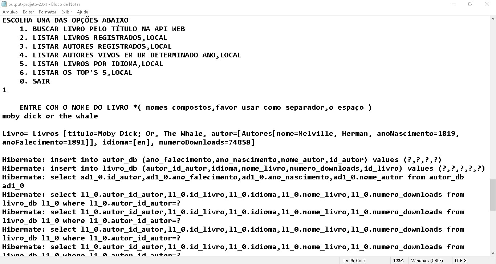  
    
***  
  
  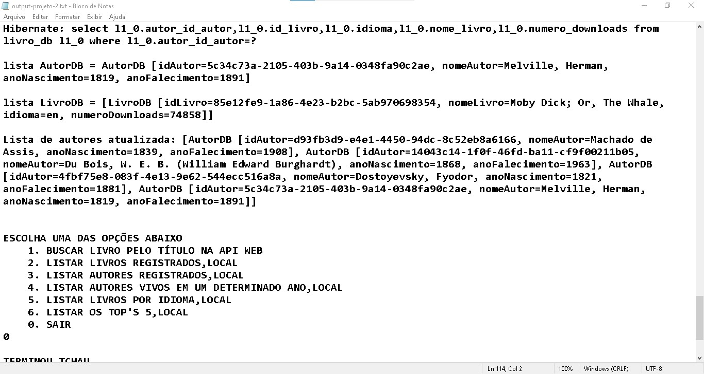  
    
***  
  
  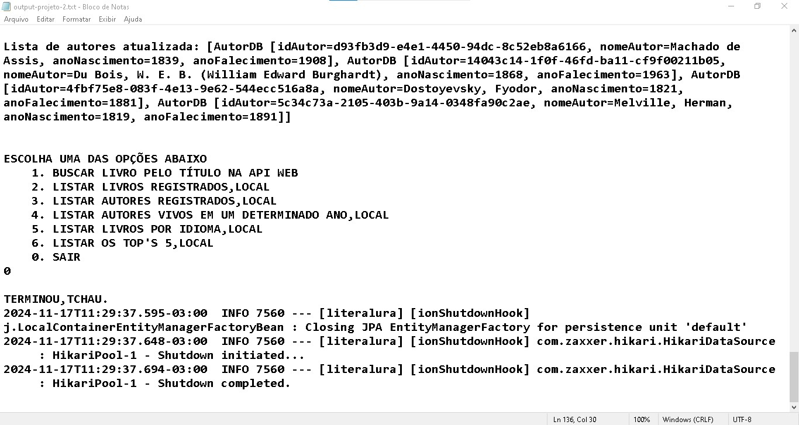      